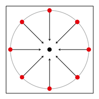
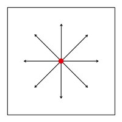

# Video from map.geo.admin
Create an animated sequence from www.map.geo.admin.ch with Python. Create a list of camera positions for a Circle, Round or Path. Produce a screenshots for every camera position. Collect them together to a video file.

## Getting Started

### Installing Software
The following software is required for successful process execution of the script:
- [Python 3](https://www.python.org/downloads)
- [Chromedriver](http://chromedriver.chromium.org/downloads)

### Installing Library
Install the following Python libraries:
```
pip install requests
pip install selenium
pip install moviepy
```

## Running Scripts
- CreateCameras (choose one mode)
  - Circle
  - Path
  - Round
- CreateScreenshots
- CreateVideo

### [CreateCameras_Circle.py](CreateCameras_Circle.py)

- Using center coordinate and radius
- Calculating camera positions in WGS84, elevations, headings and pitches
- Save calculations in a dump file

### [CreateCameras_Path.py](CreateCameras_Path.py)

- Using path in list format or KML file
- Smoothing path geometry
- Calculating camera positions in WGS84, elevations, headings and pitches
- Save calculations in a dump file

### [CreateCameras_Round.py](CreateCameras_Round.py)

- Using center coordinate
- Calculating camera positions in WGS84, elevations, headings and pitches
- Save calculations in a dump file

### [CreateScreenshots.py](CreateScreenshots.py)
- Defining base URL from www.map.geo.admin.ch
- Link and start chromedriver
- Generate and save image for every camera position 

### [CreateVideo.py](CreateVideo.py)
- Sort images
- Create list of images and collect them to a video
- Save the MP4 video file

## Edit Parameter
The following main parameters should be adapted to the specific project.

### Geometry Parameter
Coordinates  in [EPSG:2056](http://spatialreference.org/ref/epsg/ch1903-lv95/)
```
center = [2600000, 1200000] # Bern
path2D = [[2600334, 1199351],[2600276, 1199419]] # Marzilibahn
```
KML file with one `LineString` in [EPSG:4326](http://spatialreference.org/ref/epsg/wgs-84/) in example from [map.geo.admin.ch](https://map.geo.admin.ch)
```
kml = 'line.kml'
```
Constant elevation in meter above sea level.
```
elevation = 700
```
Pitch (inclination) in degree , 0 is horizontal.
```
pitch = -20
```
Radius in meter for the camera positions.
```
radius = 2000
```
Steps (amount) of camera positions or amount of screenshots.
```
steps = 4
```
Seconds of sleeping before taking a screenshot.
```
sleep = 60
```

#### Path Parameter
Place the scripts in the same folder in example.
```
C:\temp
```
The automatically generated folder has the following path.
```
C:\temp\Images
```
Then this should be the path for the chromedriver.
```
C:\temp\chromedriver.exe
```

## Video
* [Video_Saentis.mp4](Video_Saentis.mp4)
* [Video_Luzern.mp4](Video_Luzern.mp4)
* [Video_Gurten.mp4](Video_Gurten.mp4)

Open with [VLC](https://www.videolan.org) player

## Author
* **Michael Zwick** | [twitter](https://twitter.com/zwickmichael)

## History
<blockquote class="twitter-tweet" data-lang="de"><p lang="en" dir="ltr"><a href="https://twitter.com/hashtag/Python?src=hash&amp;ref_src=twsrc%5Etfw">#Python</a> script for video production with <a href="https://twitter.com/swisstopo?ref_src=twsrc%5Etfw">@swisstopo</a>, <a href="https://twitter.com/swiss_geoportal?ref_src=twsrc%5Etfw">@swiss_geoportal</a>, <a href="https://t.co/R48qMxBHAT">https://t.co/R48qMxBHAT</a>, <a href="https://t.co/eSrZVQh4kX">https://t.co/eSrZVQh4kX</a> data available on <a href="https://t.co/PZsXliGa1M">https://t.co/PZsXliGa1M</a> including example video from <a href="https://twitter.com/hashtag/s%C3%A4ntis?src=hash&amp;ref_src=twsrc%5Etfw">#säntis</a> <a href="https://twitter.com/hashtag/schw%C3%A4galp?src=hash&amp;ref_src=twsrc%5Etfw">#schwägalp</a> <a href="https://twitter.com/hashtag/alpstein?src=hash&amp;ref_src=twsrc%5Etfw">#alpstein</a> <a href="https://t.co/Dn6POec42k">pic.twitter.com/Dn6POec42k</a></p>&mdash; Michael Zwick (@zwickmichael) <a href="https://twitter.com/zwickmichael/status/1087401555282792448?ref_src=twsrc%5Etfw">21. Januar 2019</a></blockquote>

<blockquote class="twitter-tweet" data-lang="de"><p lang="en" dir="ltr">New version of <a href="https://t.co/vvuk5J6dIH">https://t.co/vvuk5J6dIH</a> available on <a href="https://t.co/PZsXliGa1M">https://t.co/PZsXliGa1M</a>. Create a video from <a href="https://twitter.com/swisstopo?ref_src=twsrc%5Etfw">@swisstopo</a> data on <a href="https://twitter.com/swiss_geoportal?ref_src=twsrc%5Etfw">@swiss_geoportal</a> with <a href="https://twitter.com/hashtag/python?src=hash&amp;ref_src=twsrc%5Etfw">#python</a>. Use new modes circle, path and round. <a href="https://twitter.com/hashtag/Bern?src=hash&amp;ref_src=twsrc%5Etfw">#Bern</a> <a href="https://twitter.com/hashtag/Gurten?src=hash&amp;ref_src=twsrc%5Etfw">#Gurten</a> <a href="https://t.co/lt1236epYm">pic.twitter.com/lt1236epYm</a></p>&mdash; Michael Zwick (@zwickmichael) <a href="https://twitter.com/zwickmichael/status/1099757290910044160?ref_src=twsrc%5Etfw">24. Februar 2019</a></blockquote>

## Acknowledgments
* Inspired by David Oesch [GitHub](https://github.com/davidoesch)
* Map viewer of the Federal spatial data infrastructure (FSDI) [map.geo.admin.ch](https://map.geo.admin.ch)
* Data from the Federal Office of Topography [swisstopo](https://swisstopo.ch)
